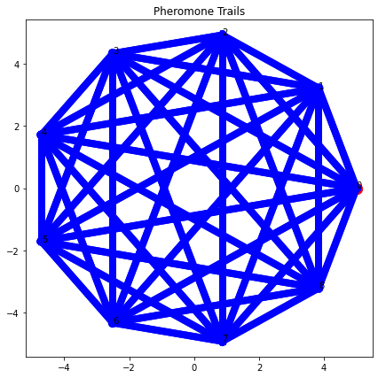

# TimeVaryingTravelingSalesman_ACO
Metaheuristic ant colony based swarm optimization for Dynamic Traveling Salesman formulation of a global orbital trajectory path planning problem. The principle behind the problem is to incrementally vary the intensity of phermone trails deposited by ants moving from node to node (of the fully connected graph that is the problem state), reinforcing paths that have the shortest Hamiltonian cycles while also accounting for previous best solutions (memory). Some images from the notebook when run for a custom set of input (orbital) parameters are shown below. Viewers can read more about the process behind the algorithm at my website on <a href="https://deepikaananth.github.io/posts/2015-08-12-Orbital-Trajectory-Optimization.html">my post about it</a>.

The problem set-up is done as time varying pieces of debris in hypothetical elliptical orbits around the Earth like shown below:

  

Pheromone trails when initialized and at the end of N number of iterations:

  
   

Final best solution path computed for a given set of initial conditions after a fixed N number of iterations:

  

